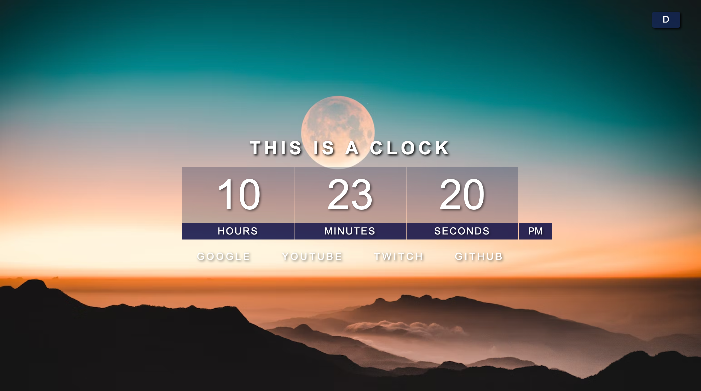
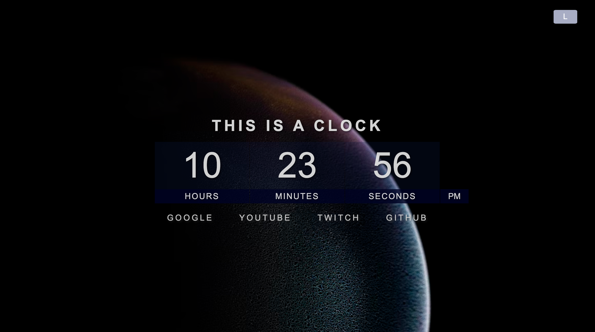

# Homepage-Clock

## Description 
A simple homepage for web browsers featuring a digital clock and some frequently visited links.  I followed a tutorial, which is linked below, to quickly develop the HTML and CSS as well as guide me through the JavaScript needed.  I decided to watch the video, comment out the directions on the JS page, and build it after watching the video, rather than following along.  I added my own elements (no pun intended) such as the links, the styling and the dark/light modes.  ENJOY! 
#

## Screenshots

Light Mode

Dark Mode

#
## Reference
[YouTube Link](https://youtu.be/EWv2jnhZErc?t=110)

@ 1:50 Project 1
#

## Link: 

